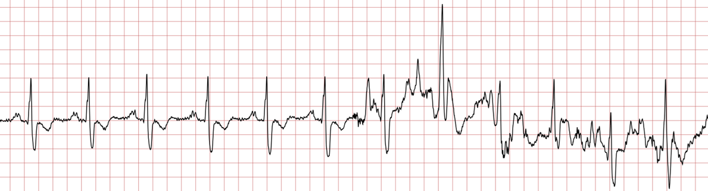

# RecogNoise

RecogNoise: Machine-Learning-Based Recognition of Noisy Segments in Electrocardiogram Signals

  

Related article: Aminifar, Amin, Khooyooz, Soheil, Jahanjoo, Anice, Shakibhamedan, Salar, TaheriNejad, Nima. “RecogNoise: Machine-Learning-Based Recognition of Noisy Segments in Electrocardiogram Signals.” IEEE International Symposium on Circuits and Systems (ISCAS), 2024.
