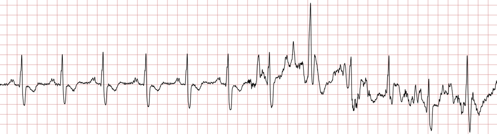

# RecogNoise

RecogNoise: Machine-Learning-Based Recognition of Noisy Segments in Electrocardiogram Signals

<div align="center">
  
</div>

Related article: Aminifar, Amin, et al. “RecogNoise: Machine-Learning-Based Recognition of Noisy Segments in Electrocardiogram Signals.” IEEE International Symposium on Circuits and Systems (ISCAS), 2024 (https://doi.org/10.1109/ISCAS58744.2024.10558670).

Video: https://www.youtube.com/watch?v=8xwGkjcMmMY

## Citation
```
@inproceedings{aminifar2024recognoise,
  author={Aminifar, Amin and Khooyooz, Soheil and Jahanjoo, Anice and Shakibhamedan, Salar and TaheriNejad, Nima},
  booktitle={2024 IEEE International Symposium on Circuits and Systems (ISCAS)}, 
  title={RecogNoise: Machine-Learning-Based Recognition of Noisy Segments in Electrocardiogram Signals}, 
  year={2024},
  doi={10.1109/ISCAS58744.2024.10558670}}
```
